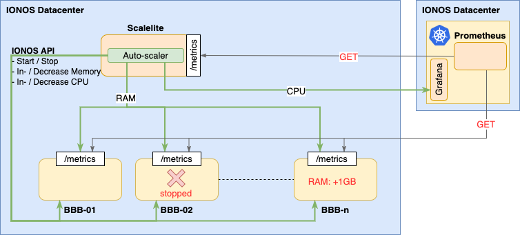

# Bigbluebutton

Scalable video conferencing on virtual machines.

## Intro
This terraform scripts do the following
1. Provisioning of n bbb-server and 1 scalelite server
2. Setup needed firewall rules in IONOS
3. Install scalelite-server with all the needed software in docker-compose
    1. Scalelite
    2. AutoScaler
    3. TLS (wildcard certificate)
    4. NodeExporter (TLS, basic auth)
4. Install bbb-server software
    1. bbb-install
    2. TLS (wildcard certificate)
    3. NodeExporter (TLS, basis auth)

## Structure

The whole setup is based on Terraform and existing installation processes for Bigbluebutton and Scalelite.

[github bigbluebutton](https://github.com/blindsidenetworks/scalelite)

[github scalelite](https://github.com/bigbluebutton/bigbluebutton)

```
|-- base
|   |-- doc
|   |-- environment
|   |   `-- dev
|   |   `-- prod
|   |-- files
|   |   `-- bbb-files
|   |   `-- scalelite-files
|   |-- keys
|   |-- testing
```
## Requirements
- [terraform/v0.12.24](https://learn.hashicorp.com/terraform/getting-started/install.html)

## Pre steps
### 0. DNS and IP stacks
Currently its not possible to handle DNS in IONOS. Thats why we have to define static DNS names beforehand. For this an IONOS IP Stack was created for each environment (DEV, PROD). These IPs where mapped to DNS names via Google Domain service. 

Example:
```bash
bbb-1.bbb.messenger.schule -> 123.123.123.123
```

Thats why we have to setup a static IP list in every ``secret.tfvars`` file

Furthermore we had to create a wildcard certicate for all the subdomains ``*.bbb.messenger.schule`` and configure this certificate during the setup phase in terraform. 

### 1. create a secrets.tfvars file with following parameter
```console
hpi_ionos_user=<IONOS USER LOGIN>
hpi_ionos_pw=<IONOS PW LOGIN>
datacenter=<IONOS DATACENTER UUID> 
turnServerPw=<TURN SERVER PW>
scalite_secret=<SCALELITE GENERATED SECRET> # openssl rand -hex 64
scalite_secret_lb=<SCALELITE GENERATED SECRET> openssl rand -hex 32
bbb_reserved_ips=<LIST OF RESERVED BBB SERVER IPs> #[""]
scalite_redisurl=<REDIS URL>
scalelite_reserved_ips=<LIST OF RESERVED SCALELITE SERVER IPs> #[""]
scalite_pg_pw=<SCALELITE POSTGRES PW>
ne_user = <Node Exporter Basic Auth user>
ne_pw = <Node Exporter Basic Auth password>
```

### 2. adjust values in terraform.tfvars
1. Go to environment/<your env>/terraform.tfvars
2. Adjust with the values you want

### 3. add wildcard certification for defined domain
add your letsencrypt cert folder to
- files/bbb-files/cert
- files/scalelite-files/data/cert

### 4. start Terraform

```bash
cd environment/<your env>/
terraform plan -var-file=secrets.tfvars
terraform apply -var-file=secrets.tfvars
```

## Architecture

The overall architecture with Scalelite and BigBlueButton is the same as described in the official [Scalelite-Repo](https://github.com/blindsidenetworks/scalelite#architecture-of-scalelite)

Currently only one Scalelite server is serving all configured BBB server. 

Additionally to this, there is running a new component called [bbb-scaler](https://github.com/schul-cloud/bbb_scaler ) on the scalelite server. 

Furthermore on every server a [node-exporter](https://github.com/prometheus/node_exporter) instance is running and exposing the system metrics. 

These metrics are collected in prometheus and are the basis for the AutoScaler component



## AutoScaler

### Intro
The AutoScaler component is monitoring the bbb cluster and will increase / decrease memory and cpu or start / stop machines, dependend on the current workload.

For this the AutoScaler checks in an configured interval the system metrics for each machine and  from the whole cluster in average. Based on this, the next steps are executed. 

The app is running on the scalelite node within docker-compose and will deployed and configured via this Terraform module.

More infos and the source code can be find at the [bbb-scaler repo](https://github.com/schul-cloud/bbb_scaler) 

### Needed parameter

These parameters can be defined in the corresponding terraform.tfvar file

example:
```bash
#
# AUTOSCALER
#
autoscaler_min_active_machines=2
autoscaler_waitingtime=300000 # 3min
autoscaler_max_allowed_memory_workload=0.85
autoscaler_min_allowed_memory_workload=0.15
autoscaler_max_worker_memory=16384
autoscaler_max_worker_cpu=4
autoscaler_max_allowed_cpu_workload=0.85
autoscaler_min_allowed_cpu_workload=0.15
```

See all the parameters in the [docker-compose.yaml](files/scalelite-files/docker-compose.yaml) file 
```yaml
- IONOS_USER=${IONOS_USER}
- IONOS_PASS=${IONOS_PW}
- IONOS_DATACENTER=${DATACENTER}
- MINIMUM_ACTIVE_MACHINES=${MINIMUM_ACTIVE_MACHINES}
- WAITINGTIME=${WAITINGTIME}
- MAX_ALLOWED_MEMORY_WORKLOAD=${MAX_ALLOWED_MEMORY_WORKLOAD}
- MIN_ALLOWED_MEMORY_WORKLOAD=${MIN_ALLOWED_MEMORY_WORKLOAD}
- MAX_ALLOWED_CPU_WORKLOAD=${MAX_ALLOWED_CPU_WORKLOAD}
- MIN_ALLOWED_CPU_WORKLOAD=${MIN_ALLOWED_CPU_WORKLOAD}
- MAX_WORKER_MEMORY=${MAX_WORKER_MEMORY}
- MAX_WORKER_CPU=${MAX_WORKER_CPU}
- DEFAULT_WORKER_MEMORY=${DEFAULT_WORKER_MEMORY}
- DEFAULT_WORKER_CPU=${DEFAULT_WORKER_CPU}
- BBB_PASS=${LOADBALANCER_SECRET}
- GRAFANA_PASS=${GRAFANA_PASS}
- GRAFANA_ENDPOINT=${GRAFANA_ENDPOINT}
```
## Monitoring

The metrics, from the installed [node-exporter](https://github.com/prometheus/node_exporter) setup, are crawled from the [prometheus installation for jitsi](https://github.com/schul-cloud/jitsi-deployment/blob/master/docs/architecture/architecture.md#monitoring) in kubernetes. 

The metrics per machine, are available at:

```url
https://<url>:9100/metrics
```

### Security

1. The node-exporter endpoint exposing its metrics via HTTPS
2. The REST call has a BASIC AUTH in place.
3. The password in the corresponding config file is hashed

```yaml
tls_server_config:
    # Certificate and key files for server to use to authenticate to client
    cert_file: /path/to/cert.pem
    key_file:  /path/to/key.pem

basic_auth_users:
    username: hashedPassword
```

## Post steps

### 1. secure keys

secure locally saved keys to 1password
- keys/hpi[-dev]-pk
- hpi[-dev]-pubkey
